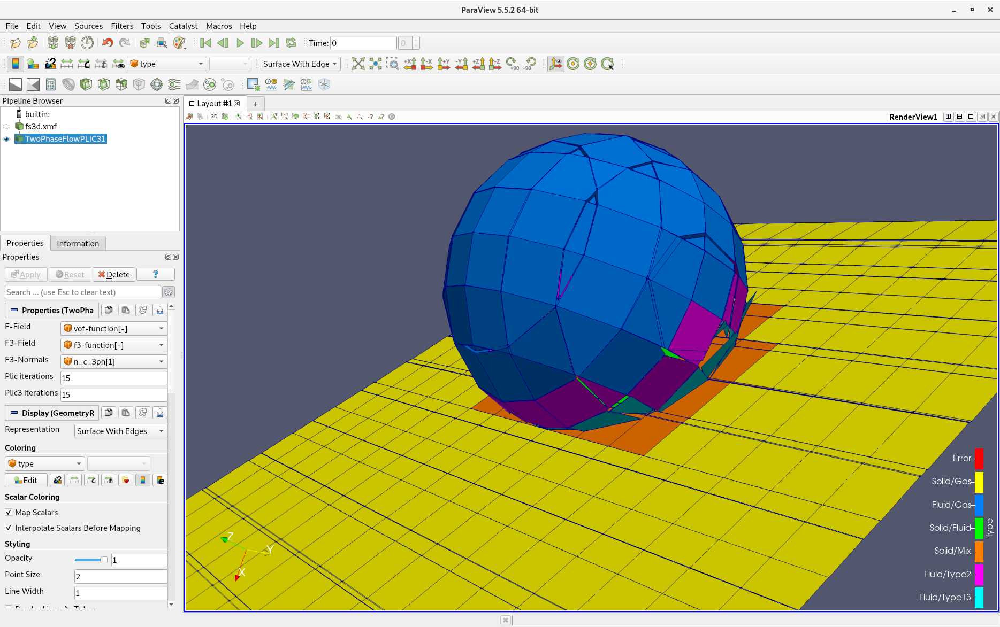

# PLIC 3

Use piecewise linear interface calculation (PLIC) for the reconstruction of solid and fluid interfaces from volume of fluid (VOF) fields in three-phase settings [1,2]. This filter applies the PLIC filter internally on cells that contain only two phases.

## Input

The following input ports are available:

| Input | Description                                                  | Type             | Remark |
| ----- | ------------------------------------------------------------ | ---------------- | ------ |
| Grid  | Grid containing volume of fluid fields and pre-calculated interface normals. | Rectilinear Grid |        |

### Grid

The grid contains the following data fields:

| Data field                     | Description                                                  | Data   | Type       | Remark |
| ------------------------------ | ------------------------------------------------------------ | ------ | ---------- | ------ |
| Volume of fluid field (liquid) | The volume of fluid field for the first fluid (liquid) phase, whose entries are in the range [0, 1]. | Scalar | Cell-based |        |
| Volume of fluid field (solid)  | The volume of fluid field for the solid phase, whose entries are in the range [0, 1]. | Scalar | Cell-based |        |
| Interface normals              | Pre-calculated normals at the interface between liquid and gas phase in cells containing three phases, or type 2 interfaces [2]. *In a three-phase setting, these are not the same as gradients, and are provided by the simulation.* | Vector | Cell-based |        |

## Parameters

The following parameters can be set by the user:

| Parameter                   | Description                                                  | Type    | Accepted values | Default value |
| --------------------------- | ------------------------------------------------------------ | ------- | --------------- | ------------- |
| Number of PLIC iterations   | Number of iterations for the iterative approximation of the interface in a two-phase setting. | Integer | \>0             | 15            |
| Number of PLIC 3 iterations | Number of iterations for the iterative approximation of the interface in a three-phase setting. | Integer | \>0             | 15            |

## Output

The output is a polygonal mesh, for which the following data fields are provided:

| Data field                        | Description                                                  | Data   | Type       | Remark |
| --------------------------------- | ------------------------------------------------------------ | ------ | ---------- | ------ |
| Type                              | The type of the interface, described by an enumeration. 0: error 1: two-phase (solid-gas interface), 2: two-phase (liquid-gas interface) 3: two-phase (solid-liquid interface) 4: three-phase (solid-fluid interface) 5: two-phase, with solid in neighbor cell (liquid-gas interface, type 2 [2]) 6: three-phase (liquid-gas interface, type 1 or 3 [2]) | Scalar | Cell-based |        |
| Interface gradients (liquid-gas)  | Gradients on the reconstructed interface between fluid phases. | Vector | Cell-based |        |
| Interface gradients (solid-fluid) | Gradients on the reconstructed interface between solid and fluid phase. | Vector | Cell-based |        |
| Volume of fluid (liquid)          | Volume of the first fluid phase (liquid) enclosed by the reconstructed interface. | Scalar | Cell-based |        |
| Volume of fluid (solid)           | Volume of the solid phase enclosed by the reconstructed interface. | Scalar | Cell-based |        |
| Interface normals                 | Interface normals between liquid and gas phase, as copy of the input. | Vector | Cell-based |        |

---

[1] A. Pathak, and M. Raessi. A three-dimensional volume-of-fluid method for reconstructing and advecting three-material interfaces forming contact lines. *Journal of Computational Physics,* 307: 550–573, 2016.

[2] Johanna Potyka. Rekonstruktion der Phasengrenzen mit statischem Kontaktwinkel für Direkte Numerische Simulationen von Dreiphasenproblemen. *University of Stuttgart,* 2018.

